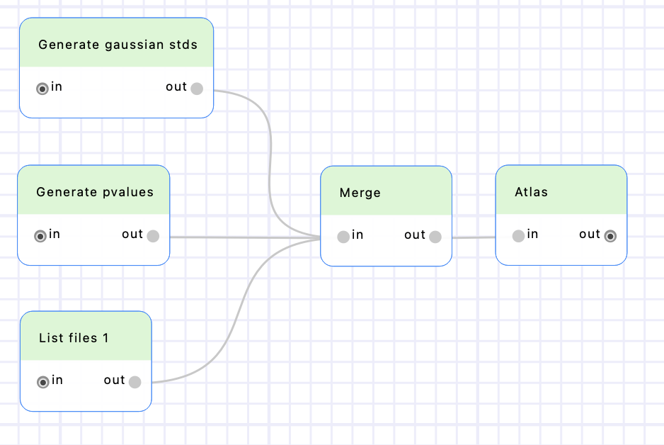
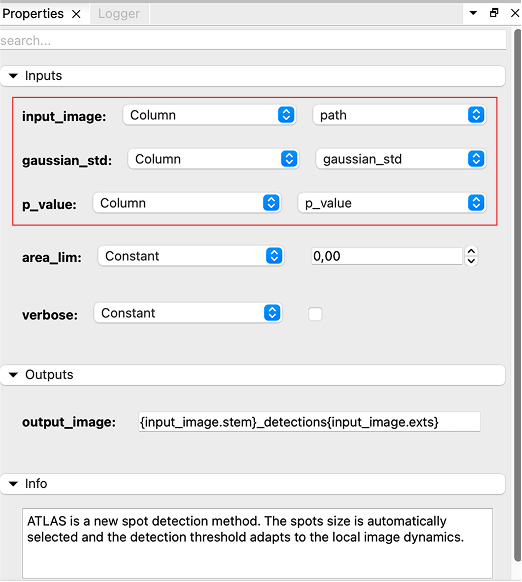

# Parameters exploration

BioImageIT provides a way to find to explore the parameter space of a tool to find the best combination for a given application.

In this tutorial, we will see it in action.

The "Generate" tool enables to generate a single column DataFrame with some values. The values are either defined by the `values`, `arange`, `linspace`, `logspace` or `geomspace` parameters (they are exclusive, only the first define parameter will be taken into account). The `values` parameter generates a list from coma-separated numbers (the value `11,22,33` will create a column with the values `[11, 22, 33]`). 

The `arange`, `linspace`, `logspace` or `geomspace` parameters enable to generate arrays from the corresponding numpy functions:
- `arange` generates evenly spaced values within a given interval (see [arange](https://numpy.org/doc/stable/reference/generated/numpy.arange.html)). For example `0,5,2` will return `[0, 2, 4]`.
- `linspace` generates a number of values over a specified interval (see [linspace](https://numpy.org/doc/stable/reference/generated/numpy.linspace.html)). For example `0,2,5` will return `[0, 0.5, 1.0, 1.5, 2.0]`.
- `logspace` generates numbers spaced evenly on a log scale (base 10) (see [logspace](https://numpy.org/doc/stable/reference/generated/numpy.logspace.html)). For example `2,3,4` will return `[100.0, 215.443, 464.159, 1000.0]`.
- `geomspace` generates numbers spaced evenly on a log scale (a geometric progression) (see [geomspace](https://numpy.org/doc/stable/reference/generated/numpy.geomspace.html)). This is similar to logspace, but with endpoints specified directly. Each output sample is a constant multiple of the previous. For example `10, 1000, 3` will return `[10.0, 100.0, 1000.0]`.

The `columnName` parameter defines the column name in the generated DataFrame.

We will use the "Generate" node to create a matrix of values to feed the "Atlas" node. This will enable to test "Atlas" with a number of parameter combination and find the best one.

Add two "Generate" nodes and rename them "Generate gaussian_std" and "Generate pvalue". Set the `values` parameter of the "Generate gaussian_std" to `30,60,120`. Set the `logspace` parameter of the "Generate pvalue" to `-3,-5,3` to generale the values `[0.001, 0.0001, 0.00001]`.

Add "List files" node to open the FISH folder from the [FISH analysis tutorial](tutorials/FOLS2_and_CSF1R_detection.md). Filter the images to obtain a single image by entering `13432*` in the `filter` parameter.

Add a "Merge" node. This node enables to merge its input DataFrames using the [pandas DataFrame.merge() method](https://pandas.pydata.org/docs/reference/api/pandas.DataFrame.merge.html#pandas.DataFrame.merge). Select "Merge" and set its `how` parameter to `cross` in order to creates the cartesian product from input DataFrames. Connect the outputs of the three first nodes to the "Merge" input. 

You will see that you obtain a DataFrame with all possible combinations of the values generated by the input nodes.

| gaussian_std | p_value       | path                       |
|--------------|---------------|----------------------------|
| 30           | 0.001         | /path/to/13432_orig.tiff   |
| 30           | 0.0001        | /path/to/13432_orig.tiff   |
| 30           | 0.00001       | /path/to/13432_orig.tiff   |
| 60           | 0.001         | /path/to/13432_orig.tiff   |
| 60           | 0.0001        | /path/to/13432_orig.tiff   |
| 60           | 0.00001       | /path/to/13432_orig.tiff   |
| 120          | 0.001         | /path/to/13432_orig.tiff   |
| 120          | 0.0001        | /path/to/13432_orig.tiff   |
| 120          | 0.00001       | /path/to/13432_orig.tiff   |

Finally add an "Atlas" node and connect it to the "Merge" output. Set its `input_image` parameter to the `path` column (this should be automatic), its `gaussian_std` parameter to the `gaussian_std` column, and its `pvalue` to the `pvalue` column.

Execute the workflow to perform the 9 Atlas detections on the input image with the generated parameters.
Finally, open the resulting images in Napari by clicking on the obtained thumbnails to determine which parameter combination is best for the input image!

:::{admonition} Note on the output names
:class: tip

By default, the Atlas `output_image` is defined as `{input_image.stem}_detections{input_image.exts}`. Thus, our images are named `13432_orig_detections0.tiff`.
BioImageIT automatically suffixed the output paths with indices to avoid collisions (which would result in overwriting the generated files).
This is good because our images have different names, but it would be even better if we had the parameter names in our filename to make them more explicit. For this purpose, we can rename the "Atlas" output to `{input_image.stem}_detections_gaussianstd{gaussian_std}_pvalue{p_value}{input_image.ext}`.
See the [outputs documentation](outputs.md) for more information.
:::