# FOLS2 and CSF1R detection in FISH images

<!-- This tutorial will explain the main features of BioImageIT so that you can easily build and share workflows.

This tutorial will show how to count the number of spot per nucleus on FISH (Fluorescence In Situ Hybridization) images, analyzing FOLS2 (green), CSF1R (red), and nuclei (blue) in breast cancer tissue. -->


This tutorial will show how to analyse [FISH (Fluorescence In Situ Hybridization) images](https://www.cellimagelibrary.org/groups/13438) from the Cell Image Library. The objective will be to compute the average number of spots per nucleus, analyzing FOLS2 (green), CSF1R (red), and nuclei (blue) in breast cancer tissue.

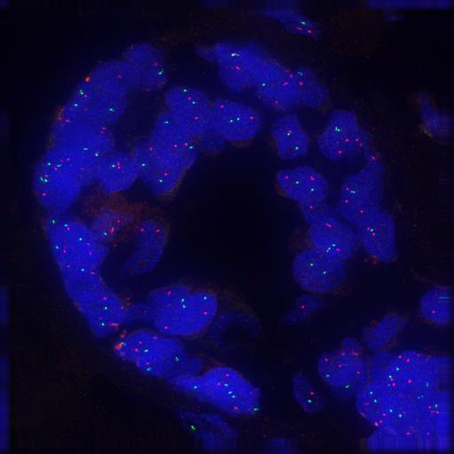

Here is the different processing steps of the workflow:
- Convert the image to RGB (optional)
- Split the 3 channels
- Detect spots on channels 1 & 2
- Compute connected components to differenciate each spot
- Segment nuclei on channel 3 with SAM
- Compute the overlaps between detected spots and the nuclei
- Count the average number of spots per nucleus

## Prepare the data

Create a FISH folder on your computer, and download the following images in it:
 - [13432.tif](https://cildata.crbs.ucsd.edu/media/images/13432/13432.tif)
 - [13434.tif](https://cildata.crbs.ucsd.edu/media/images/13434/13434.tif)
 - [13436.tif](https://cildata.crbs.ucsd.edu/media/images/13436/13436.tif)
 - [13438.tif](https://cildata.crbs.ucsd.edu/media/images/13438/13438.tif)

## Create workflow


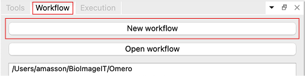

To create a workflow, go to the "Workflow" tab and click "New workflow". A dialog will open for you to create the folder of your workflow. Choose a location for the folder, enter "Tutorial" its name and save; BioImageIT will create the workflow folder.

All data generated by your workflow will be saved here and follow the following structure:
```
path/to/workflow/
├── Data
│   ├── Node 1                    # Output data of node 1
│   ├── Node 2                    # Output data of node 2
│   └── ...
├── Metadata                      # Note that this is not exactly metadata
│   ├── Node 1                    # Parameters and dataframe of node 1 (parameters.json and output_dataframe.csv)
│   ├── Node 2                    # Parameters and dataframe of node 2 (parameters.json and output_dataframe.csv)
│   └── ...
├── Thumbnails
│   ├── Node 1                    # Thumbnails of node 1 outputs
│   ├── Node 2                    # Thumbnails of node 2 outputs
│   └── imageToThumbnail.json     # Map which links thumbails with original images
├── Tools
│   ├── Custom tool 1             # A tool designed specifically for the workflow
│   └── ...
└── workflow.pygraph              # The file which describe the workflow graph (DAG)
```

## Create nodes

Nodes are listed in the Tools tab, organized by categories. You can search for specific tools with the search bar. 

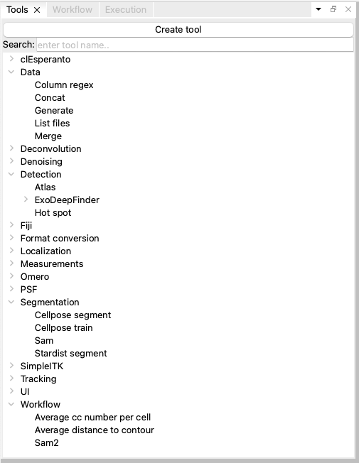

*Tool library*

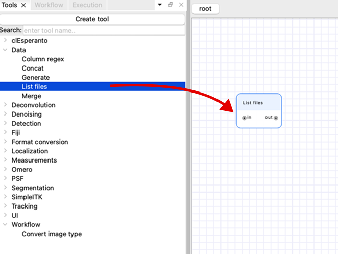

Choose the "List files" tool from this list and drag it to the canvas to add a node to the workflow.

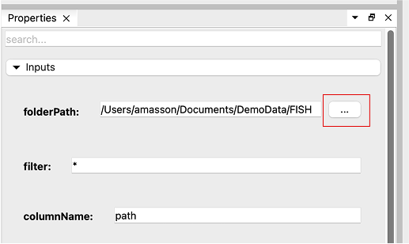

Select the "List files" node, go to the "Properties" tab and set the "folderPath" parameter by using the browse button "...". Choose the FISH folder containing the images you downloaded (make sure to select the folder, not the files inside; you might need to go up in the file hierarchy to select the FISH folder containing the images).

The "List files" node will generate a dataframe from its parameters, containing one column named "path" with four file paths. You can filter those images with the "filter" parameter, and change the "columnName" to something more descriptive if you want (we will consider those untouched for the rest of the tutorial).

BioImageIT will generate image thumbnails (in the background, and in parallel) for any existing image path in the DataFrames.

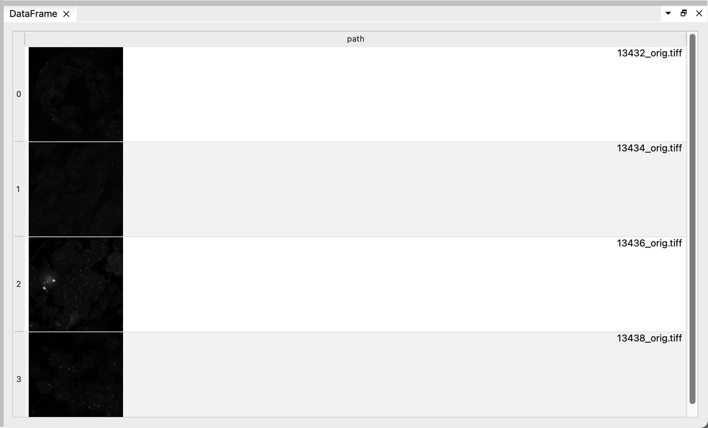

You can see the resulting DataFrame with the image thumbnails in the "DataFrame" tab when you select the "List files" node. Click on one of the image to open it on Napari. This will create a Conda environment for Napari and install it if necessary (this could take a few minutes since it must install all Napari dependencies), then open the image.

:::{admonition} Use your own Napari installation
:class: tip

You can also use your own Napari installation by specifying your Napari Environment in the "Preferences" window (File menu (BioImageIT menu on macOS) > Preferences... , then General tab > Common > Napari environment). This can be useful if you already have plugins installed in your Napari and you don't want to reinstall everything.
:::


In Napari, you can see that the 3 components of the image are seperated in differente slices. Thus, the preview thumbnails generated by BioImageIT to display the DataFrame are mainly black. Instead, we would like the 3 components to be in the 3 RGB channels of the image. For that, we can use the "Convert image" tool in the "Format conversion" category.

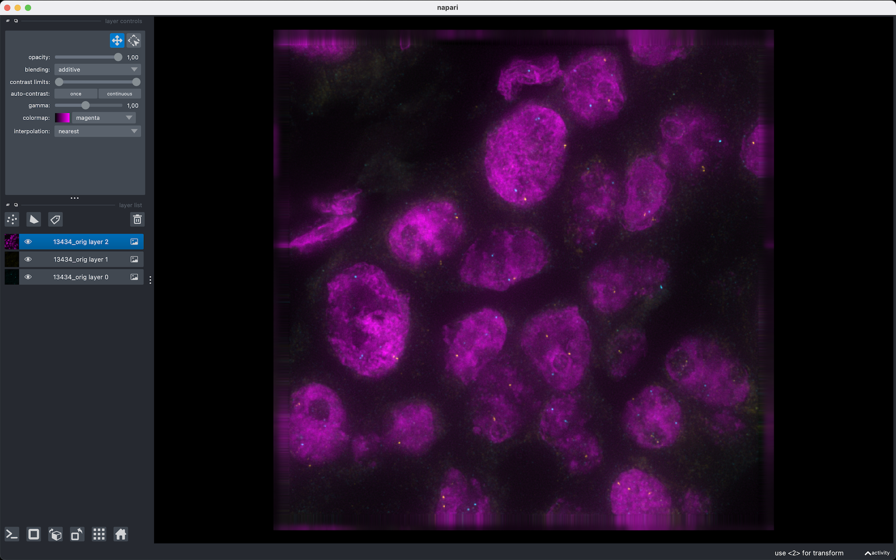

*In Napari, you can also right click on the image layer and select 'Split Stack' to see the 3 channels in different colors*

Drag a "Convert image" node on the workflow, but don't connect it yet to the "List files" node.

Select the "Convert image" node, go to the "Properties" tab and use the browse button "..." to select the first FISH image for the "input_image" parameter. Open the advanced parameters and hover the "merge" parameter with your mouse for a second. A tooltip provides more information about the parameter: "Combine seperate channels into RGB image". 


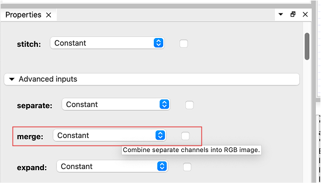

Tick the parameter and execute the workflow by clicking the "Run unexecuted nodes" in the "Execution" tab. BioImageIT will execute the "Convert image" node on the selected image, and generate a new thumbnail for the resulting image. 

:::{note}

The "Convert image" tool uses *Bio-Formats*, a standalone Java library for reading and writing life sciences image file formats. More precisely, it uses bfconvert which is a command-line tool to convert images. BioImageIT will create an environment for this tool, install the necessary dependencies (openjdk 11), download the necessary tools (bftools, the *Bio-Formats* command-line tools), and launch a server in this environment which listens for orders. Anytime the user executes the workflow, BioImageIT will tell this server to execute the conversion function on the given data.
:::

As you can see, the thumbnail (in the "Convert image: output_image" column) is now in color and much more informative. The node has turned green to indicate that the execution succeeded. It will turn orange if you modify its parameters to indicate that its output data is not up-to-date with the parameters anymore.

Connect the two nodes by draging the output pin of the first node to the input pin of the second node.

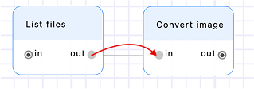

## Node parameterizing and DataFrames

The "Convert images" node receives the DataFrame generated by the "List files" node. This DataFrame will provide the file paths and other parameters necessary for the execution of the "Convert image" node. 

Click the "Convert images" node and notice that all its parameters have an additional "Constant / Column" dropdown to either set the parameter as a fixed value, or from a column. By default, the "input_image" is set to "Column", since we often want to convert a set of different images; and all others are set to "Constant", since we often want to apply the same kind of conversion on all images. 

When executed, the node tool will be executed once for each row of the input DataFrame. For each row, the "Constant" parameters will remain the same, and the "Column" parameters will be set to the value of the row at the specified column. In our case, the "Convert image" tool will be executed  4 times, each time with a different "input_image" but with constant values for the other parameters ("merge" will be true for all images).

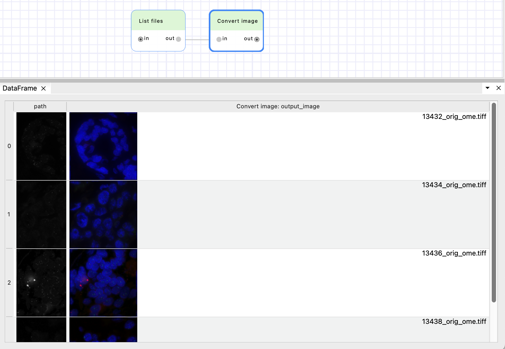

You can also notice that the output DataFrame of the "Convert image" node has two columns: 
- "path", which was created by "List files" node, 
- and "Convert image: output_image" which is the output image paths of the "Convert image" node.

The "output_image" parameter is "{input_image.stem}_ome.tiff" by default. BioImageIT will replace the value "{input_image.stem}" by the stem value (file name without extension) at the column "input_image". See more in the [automatic output documentation](../outputs.md).

Execute the workflow to convert the 4 images.


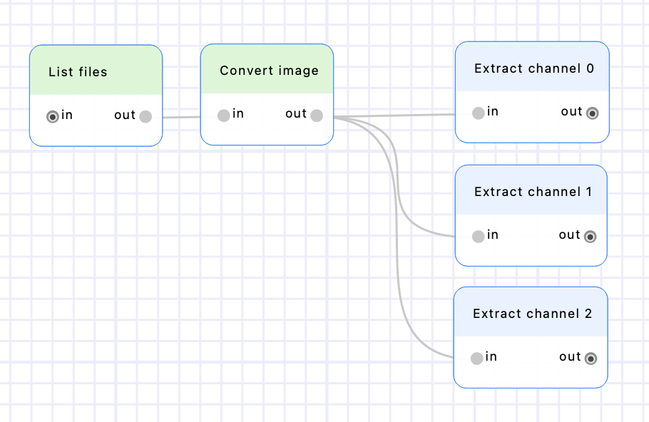

Add 3 "Extract channel" nodes and connect them after the "Convert image" node. Set their "channel" parameter to a constant value of 0, 1 and 2 respectively ; and rename them accordingly by double-clicking on their name (on the node header on the canvas). Execute the workflow to extract the 3 images.

Create two "Atlas" nodes (from the "Detection" category), put them after the "Extract channel 0" & "Extract channel 1" nodes, and rename them accordingly. Set their "gaussian_std" parameters to 120, and their "p_value" parameters to 0,00001. See the [Finding optimal parameters in BioImageIT](../parameters_exploration.md) section to learn more about searching the parameters space.


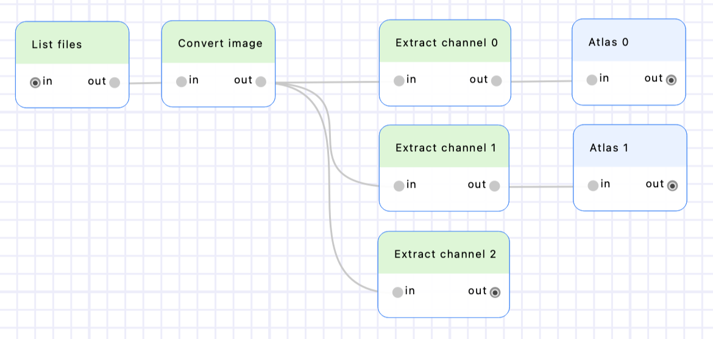

Execute the workflow to detect the spots in channels 1 & 2.

Create two "Connected components" nodes (from the "SimpleITK > Custom" category), put them after the "Atlas 0" and "Atlas 1" nodes and rename them accordingly. Execute the workflow to detect the connected components.

Create a "Sam" node (from the "Segmentation" category) and put it after the "Extract channel 2" node. Execute the workflow to compute the sam detections.

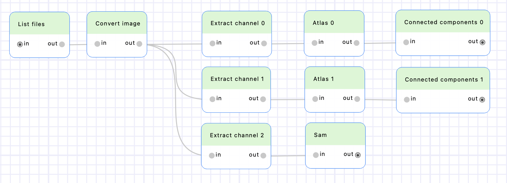

Create two "Label overlaps" nodes (from "SimpleITK > Custom" category), put them after the "Connected components 0" and "Connected components 1" nodes, and rename them accordingly. Connect the output of the "Sam" node to their inputs. Make sure the input parameter "label1" is set to the "Sam: segmentation" column for both "Label overlaps" nodes, and "label2" is set to the "Connected component N: labeled_image" column (and not "Connected component N: labeled_image_rgb"). Execute the workflow to compute the overlaps. 


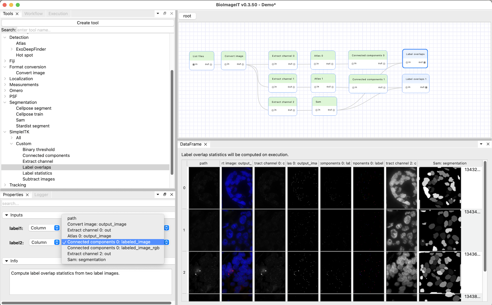

Note that unlike the nodes we used until now, the "Label overlaps" nodes do not generate new images. The DataFrames they generate is not filled with the output image paths, but with the details of the label overlaps. The "label 1" column lists the connected components of the first input image (the Sam segmentation of the nuclei in our case), the "label 2" column lists the connected components of the second input image (the Atlas spot detections) overlapping those nuclei. The "overlap" column corresponds to the number of pixels shared by the two connected components. 

One can see numerous connected components overlapping the label 1 in the Sam segmentation because it corresponds to the background. We will see how to filter those out in the next step.

## Create a custom tool

Now, we must process the DataFrames we obtained to count the average number of spots per nucleus. Create a custom tool for this purpose by clicking the "Create tool" button in the Tools tab. Enter "Average number of spots per nucleus" for the name and click "OK". This will create a definition file for the tool and open it in a code editor (defined in the Preferences > "External code editor"). 


Modify the file to set a proper name and description (for example "Average number of spots per nucleus" and "Compute the average number of spots per nucleus.").

The `categories` attribute defines where the tool will appear in the "Tools" tab.
The name of the conda environment in which the tool will be executed is defined by the `environment` attribute.
Our tool does not need any external library, so we can use the main `bioimageit` environment; and we can let the defaults for `dependencies` (use python 3.10 and do not install any pip or conda dependency).

Our tool does not need any input or output (except the DataFrame) so we can set empty lists for those (`inputs = []` and `outputs = []`).

We only need to process the DataFrame, not the associated Data. Thus, we can get rid of the `processData()` method and only keep `processDataFrame()`.

Let's implement `processedDataFrame()`.

Here's a sample input DataFrame with two different images and multiple labels per image.

| index | image1                   | image2                   | label1 | label2 | overlap |
|-------|--------------------------|--------------------------|--------|--------|---------|
| 0     | /data/imgs/image_A.tif   | /data/masks/mask_A.tif   | 1      | 10     | 50      |
| 1     | /data/imgs/image_A.tif   | /data/masks/mask_A.tif   | 2      | 12     | 30      |
| 2     | /data/imgs/image_A.tif   | /data/masks/mask_A.tif   | 3      | 15     | 25      |
| 3     | /data/imgs/image_A.tif   | /data/masks/mask_A.tif   | 3      | 20     | 60      |
| 4     | /data/imgs/image_B.tif   | /data/masks/mask_B.tif   | 2      | 11     | 40      |
| 5     | /data/imgs/image_B.tif   | /data/masks/mask_B.tif   | 2      | 12     | 35      |
| 6     | /data/imgs/image_B.tif   | /data/masks/mask_B.tif   | 3      | 18     | 20      |


First we need handle the case where the input DataFrame is not valid for our processing. Let's return an empty DataFrame if the 'label1' column does not exist in the input DataFrame. Then we can filter out all rows for which label1 is 1 or less.


```python
def processDataFrame(self, dataFrame, argsList):
    # Make sure the input dataFrame has the 'label1' column, otherwise return an empty DataFrame
    if 'label1' not in dataFrame.columns: return pandas.DataFrame()
    
    # Filter out rows for which label1 is 1 or less
    dataFrame = dataFrame[dataFrame['label1']>1]
```

After that, the first line of our example DataFrame will be removed since its label1 is 1.

| image1                | image2               | label1 | label2 | overlap |
|-----------------------|----------------------|--------|--------|---------|
| path/to/image_A.tif   | path/to/mask_A.tif   | 2      | 12     | 30      |
| path/to/image_A.tif   | path/to/mask_A.tif   | 3      | 15     | 25      |
| path/to/image_A.tif   | path/to/mask_A.tif   | 3      | 20     | 60      |
| path/to/image_B.tif   | path/to/mask_B.tif   | 2      | 11     | 40      |
| path/to/image_B.tif   | path/to/mask_B.tif   | 2      | 12     | 35      |
| path/to/image_B.tif   | path/to/mask_B.tif   | 3      | 18     | 20      |
| path/to/image_B.tif   | path/to/mask_B.tif   | 4      | 21     | 28      |

Then we goup the DataFrame by `image1` and `label1`, and counts how many times each combination appears.

```python
counts = dataFrame.groupby(['image1', 'label1']).size().reset_index(name='count')
```

The resulting DataFrame will be:


| image1              | label1 | count |
|---------------------|--------|-------|
| path/to/image_A.tif | 2      | 1     |
| path/to/image_A.tif | 3      | 2     |
| path/to/image_B.tif | 2      | 2     |
| path/to/image_B.tif | 3      | 1     |
| path/to/image_B.tif | 4      | 1     |


Then we compute the average of the `count` values for each `image1` and name them `average_spots_number_per_nucleus`.

```python
avg_occurrence = counts.groupby('image1')['count'].mean().reset_index(name='average_spots_number_per_nucleus')
```

The resulting DataFrame will be:

| image1              | average_spots_number_per_nucleus |
|---------------------|----------------------------------|
| path/to/image_A.tif | 1.50  (3 spots / 2 nuclei)       |
| path/to/image_B.tif | 1.33  (4 spots / 3 nuclei)       |


Wrap it into a new DataFrame with a fresh index:

```python
return pandas.DataFrame(avg_occurrence).reset_index()
```

Here is the final code for our custom tool:

```python
    name = "Average number of spots per nucleus"
    description = "Compute the average number of spots per nucleus."
    categories = ['Workflow']
    environment = 'bioimageit'
    dependencies = dict(python='3.10', conda=[], pip=[])
    inputs = []
    outputs = []
    
    def processDataFrame(self, dataFrame, argsList):
        if 'label1' not in dataFrame.columns: return pandas.DataFrame()
        # Remove rows corresponding to label 1 (the background)
        dataFrame = dataFrame[dataFrame['label1']>1]

        # Group the rows by image1 and label1 (we want to group rows which belong to the same image and the same nuclei)
        # Compute the size of each group, and name the obtained column 'count'
        counts = dataFrame.groupby(['image1', 'label1']).size().reset_index(name='count')

        # Compute the average group size for each image
        avg_occurrence = counts.groupby('image1')['count'].mean().reset_index(name='average_spots_number_per_nucleus')

        return pandas.DataFrame(avg_occurrence).reset_index()
```

Save the file. You will see the new "Convert average number of spots per nucleus" is available in the Tools tab of BioImageIT, in the "Workflow" category. Add two nodes from this tool to the workflow and connect them to the "Label overlaps" nodes outputs. 


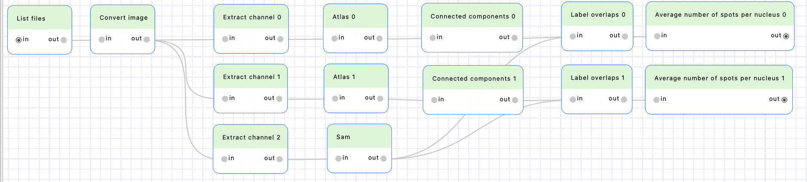

We completed our workflow to compute the number of spots per nuclei!

You can now share your workflow with the "Export workflow" button of the "Workflows" tab. This will create a zip archive containing all files required to execute the workflow on another machine.