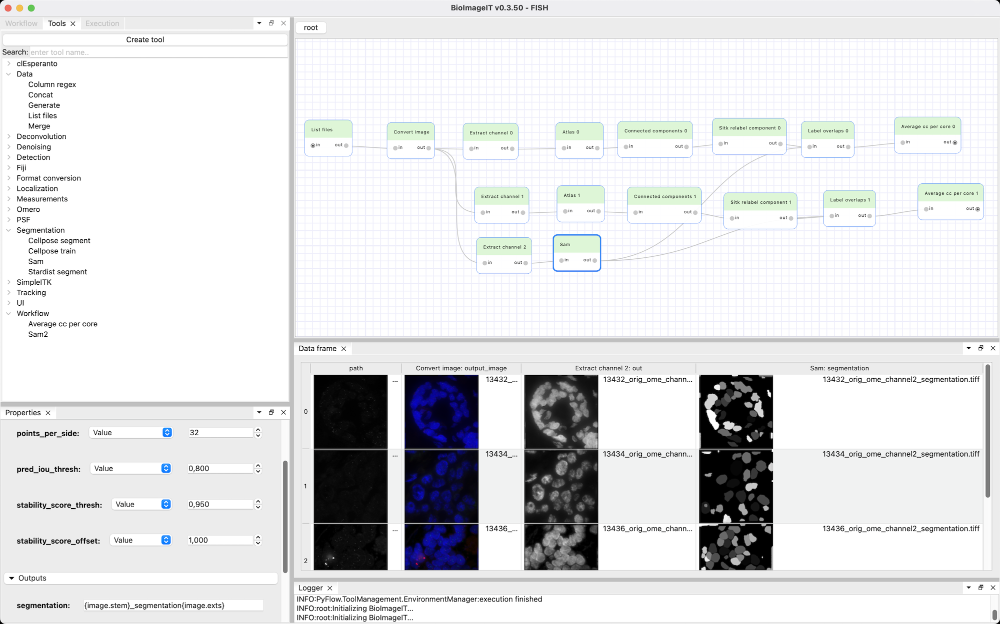

# Get Started


*BioImageIT Graphical User Interface*

## 1. Download BioImageIT

```{include} download.md
:start-after: <!-- start-part -->
:end-before: <!-- end-part -->
```

## 2. Create a workflow

When BioImageIT opens for the first time, you will be asked to choose a folder path for your first workflow. Choose a location and enter a name for your workflow, BioImageIT will create the workflow folder for you and populate it with the workflow files.

## 3. Add and connect some nodes

Use the "Tools" tab to add node to your workflow by drag-n-droping any tool on the canvas.

For example, add a "List files" node and a "Cellpose_segmentation" node, and connect them by drag-n-dropping the output pin of the first to the input pin of the second.

Then, select the "List files" and use the browse button of the `folderPath` parameter in the "Properties" tab to select a folder containing cell images on your computer.

## 4. Execute the workflow

Finally, execute the workflow with the "Run unexecuted nodes" from the "Execution" tab to compute your segmentations. BioImageIT will create an environment for Cellpose, install its dependencies, and run the segmentation on the images you selected.

To go further, see the tutorials in the next section.